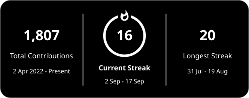

<table style="width: 100%; table-layout: fixed;">
  <tr>
    <td valign="top" width="25%">
<pre style="white-space: pre-wrap;">                                                                                                      
 .........-#############################++++#+++#++       
 ........###############################+++-++---++
 ......#########################+..-#######+------+
 ...-############++#######+#################+++++++
 .+########+#++++++####-.       .+##########+++++++     
 ###########++-.-+#+###-++-.       ###########+++++          
 ########++##########--##+         ###############+          
 ########++++##+++###-.+#+       +#################          
 #######+#######+--..+#+-. . .-#################+++          
 #######++######+--------.....-+++##########++--++-          
 #########+#######+#+-----..-++############+-...-..        
 ########+##########+++++#+++###########+####++++++          
 #######+############################+.. -####+++--  
 ######++####++########################-.-###++++++       
 #####++++++++++#######################++. .-+++++#
 ####++++++#######++##################+###+-+++++##
 ####+++#+#################################+---+###
 ---++++################################+-..  .....
 .-+#+#+######+--####################+-.....  .  ..
 ++#################+###########+--.----........--+
 +-++++++########################- ##++---..--++++-     
 .--+########################-+##++---++++++-.. .-+       
 .------+##########################+##++----##++--.    
 --+#+-+##############################++---+##++.           
 ++---++#############################++----##++-..-       
 +--+++##############################++---+##+++++#        
 -+--+###############################++---###++####      
 -----##############################++--+###++#####       
 -----++++############################++-+##++#####   
 -+++-+++#############################++-+##++#####    
 ++++++###############++-+#############+--++-+#####
 --+++####################+++-+####################
                                                                                              
</pre>
    </td>
    <td valign="top" width="50%">
      <h3>Famanias likes to code.</h3>
      
<code>AI</code> <code>Web Development</code> <code>UX/UI</code> <code>Automation</code>

      
hmu if you wanna collab on a project.

      

    </td>
  </tr>
</table>